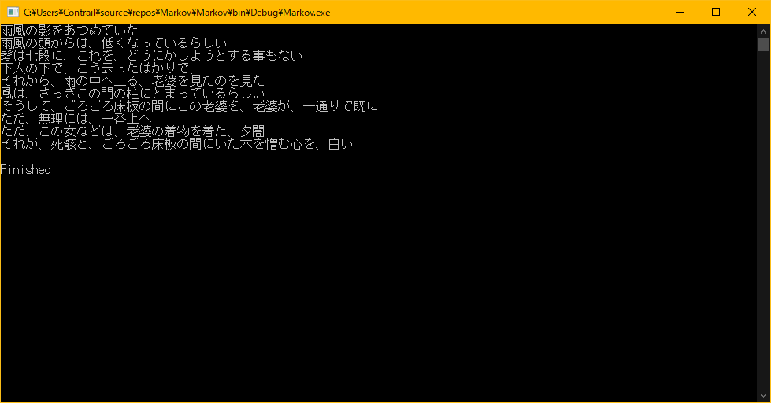

# ランダム文章生成 for C#
ランダムな文章をマルコフ連鎖を用いて生成するライブラリ。\
Creates random sentences with Markov chain.

## Demo

学習元：羅生門（芥川龍之介）

## Sample Code
```cs
MarkovChain markov = new MarkovChain();
// Specify sentence length (optional)
markov.tripletsLengthMax = 10;
markov.tripletsLengthMin = 5;
// Load dataset
markov.LoadText(filepath);

// Generate a sentence
Console.WriteLine(markov.Generate());
```

## Requirement
* MeCab

# License
[MIT License](https://en.wikipedia.org/wiki/MIT_License)